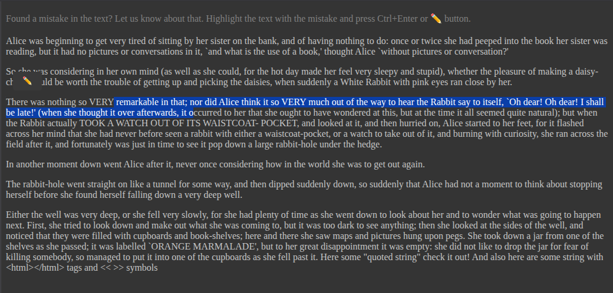
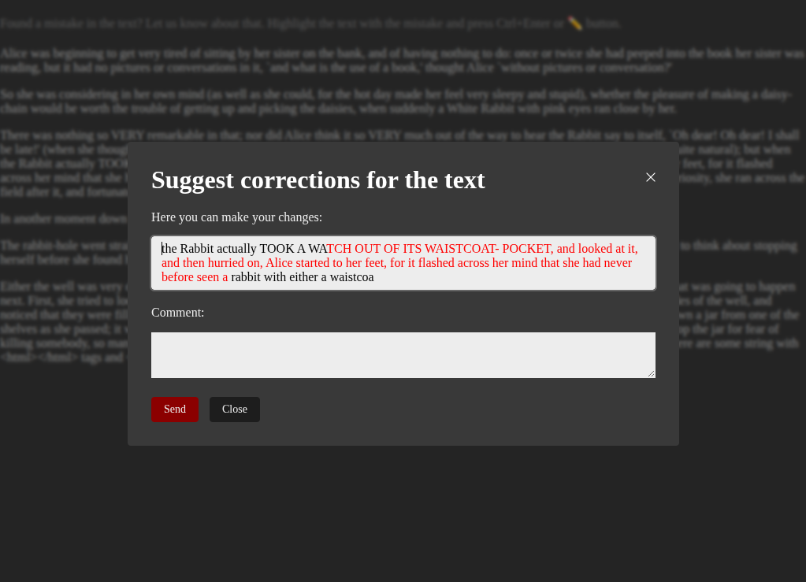
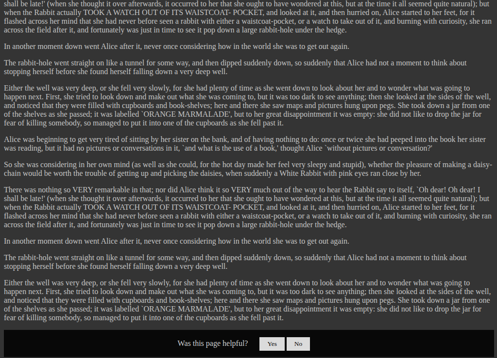
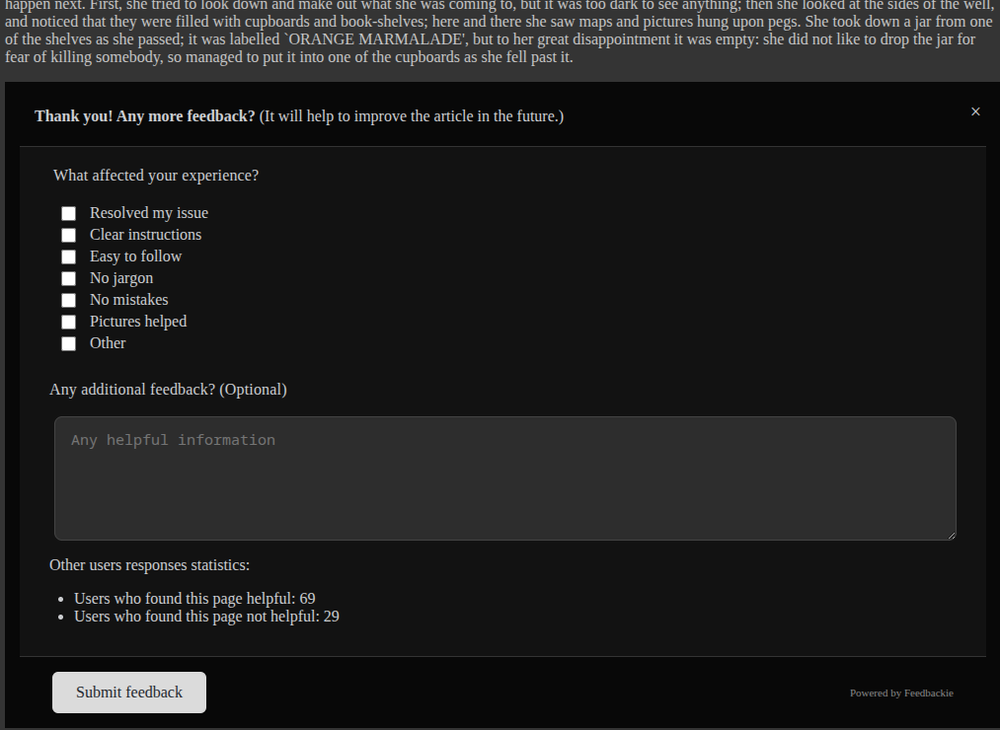

Feedbackie is a service for collecting feedback and bug reports on articles, developed using Laravel and the FilamentPHP admin panel. It can be useful for bloggers, documentation sites, and website owners who want to improve their content. You can deploy the application on your own server.

Essentially, the tool has two functions:

- **Collecting bug reports:** Gather mistakes and typo corrections from your website visitors.
- **Collecting feedback on content usefulness:** Gather feedback on how useful your site materials are for your visitors.

No matter how many times we try to proofread written articles, they still contain grammatical errors, inaccuracies, missing punctuation marks, and so on. It would be great if users who read an article and notice an error could suggest a correction. Feedbackie allows users to highlight text on a page, correct the error, and then send the correction to you. You will be able to manage all corrections in the application admin panel.

Additionally, the tech industry is constantly evolving and changing, so information in articles becomes outdated. Using the feedback tool, you can allow your visitors to tell you which articles need to be rewritten or updated.

Note that the project is currently in Alpha. All features are functional, but some bugs remain to be addressed.

## Links

- Website: [feedbackie.app](https://feedbackie.app)
- DockerHub: [seriyyy95/feedbackie-app](https://hub.docker.com/r/seriyyy95/feedbackie-app)

## Running Using Docker

The application is intended to be deployed on your own server using Docker. You can use the following command to try it out locally:

```bash
docker run -it --rm -p 80:80 seriyyy95/feedbackie-app:latest
```

In this case, the application will be available at `http://localhost/admin`, but all data will be lost after stopping the container. To check widgets, use the following pages:

- `http://localhost/report-widget` - example page with mistake report widget
- `http://localhost/feedback-widget` - example page with feedback collection widget

If you want to persist data, you need to mount a volume to the `/data` directory in the container. The directory should be created before the first run:

```bash
mkdir feedbackie
cd feedbackie
mkdir data
docker run -it --rm -v ./data:/data -p 80:80 seriyyy95/feedbackie-app:latest
```

By default, an SQLite database is used. The application will automatically create a user with the login `admin` and password `password`, and you'll be able to log in at `http://localhost/admin`.

## Running in Docker Compose

For a full deployment of the application, it's better to use Docker Compose and a PostgreSQL database. Here's an example configuration:

```yaml
volumes:
    app-data:
    db-data:
services:
    app:
        restart: unless-stopped
        init: true
        image: seriyyy95/feedbackie-app:latest
        ports:
            - "80:80"
        volumes:
            - app-data:/data
        environment:
            - ADMIN_PASSWORD=${ADMIN_PASSWORD:-password}
            - DB_HOST=postgresql
            - DB_PORT=5432
            - DB_PASSWORD=${DB_PASSWORD:-password}
            - DB_DATABASE=feedbackie_db
            - DB_USERNAME=${DB_USERNAME:-feedbackie_user}
            - DB_CONNECTION=pgsql
        depends_on:
            - postgresql
        networks:
            - default
    postgresql:
        restart: unless-stopped
        image: postgres:latest
        environment:
            - POSTGRES_DB=feedbackie_db
            - POSTGRES_USER=${DB_USERNAME:-feedbackie_user}
            - POSTGRES_PASSWORD=${DB_PASSWORD:-password}
        volumes:
            - db-data:/var/lib/postgresql/
        networks:
            - default
networks:
  default:
```

## Development

To start developing the application, you can use the provided `docker-compose.yaml` file. It mounts the source code into the container, allowing you to make changes and see them reflected immediately.

First, clone the repository with submodules:

```bash
git clone --recurse-submodules https://github.com/feedbackie/feedbackie-app.git
```

Create the `.env` file based on `.env.example` and adjust environment variables as needed:

```bash
cp .env.example .env
```

Then you can start the development environment with the following command:

```bash
docker-compose up
```

Most functionality is available in the separate package named `feedbackie/core`. You can find it in the `packages/feedbackie/core` directory.

## Environment Variables

Here are the environment variables you can use to configure the container:

- `ADMIN_PASSWORD` - administrator password; default is `password`.
- `ADMIN_EMAIL` - administrator email; default is `admin@feedbackie.app`.
- `ADMIN_PATH` - prefix for the admin panel; default is `admin`.
- `APP_DEBUG` - enable debug mode and show all errors; default is `false`.
- `APP_URL` - URL where the application will be accessible; default is `localhost`.
- `DB_HOST` - database host.
- `DB_PORT` - database port.
- `DB_DATABASE` - database name.
- `DB_PASSWORD` - database password.
- `DB_USERNAME` - database username.
- `DB_CONNECTION` - database type; available options are `sqlite` and `pgsql`, and the default is `sqlite`.

## Widget Options

To configure the widgets, you need to define a JavaScript object named `feedbackie_settings` globally with the following properties:

### General

- `base_url` - URL of the application. The default is empty, and it must be set for widgets to work.
- `display_powered_by` - show "powered by feedbackie" text in the widgets; default is `false`.

### Report widget

- `report_enabled` - enable the mistake report widget; default is `false`.
- `report_display_message` - show a message that the user can report mistakes; default is `true`.
- `report_display_button` - show a button to open a mistake report form when the user selects text; default is `true`.
- `report_message_insert_type` - method of inserting the message about mistake reports.
- `report_message_anchor_selector` - selector of the element to which the message will be inserted.

### Feedback widget

- `feedback_enabled` - enable the feedback collection widget; default is `false`.
- `feedback_sticky_ratio` - make the feedback widget sticky after scrolling down the page; default is `0`, which means that the widget will not be sticky.
- `feedback_sticky_percent` - make the feedback widget sticky after scrolling down the page by a certain percentage; default is `50`.
- `feedback_widget_insert_type` - method of inserting the feedback widget.
- `feedback_widget_anchor_selector` - selector of the element to which the feedback widget will be inserted.
- `feedback_widget_theme` - theme of the feedback widget. Available options are `light`, `dark`, and `adaptive`; the default is `adaptive`.

## Widget examples

Report about mistake message and button:



Report about mistake modal:



Helpfulness feedback collection widget:



Extended feedback collection widget:


